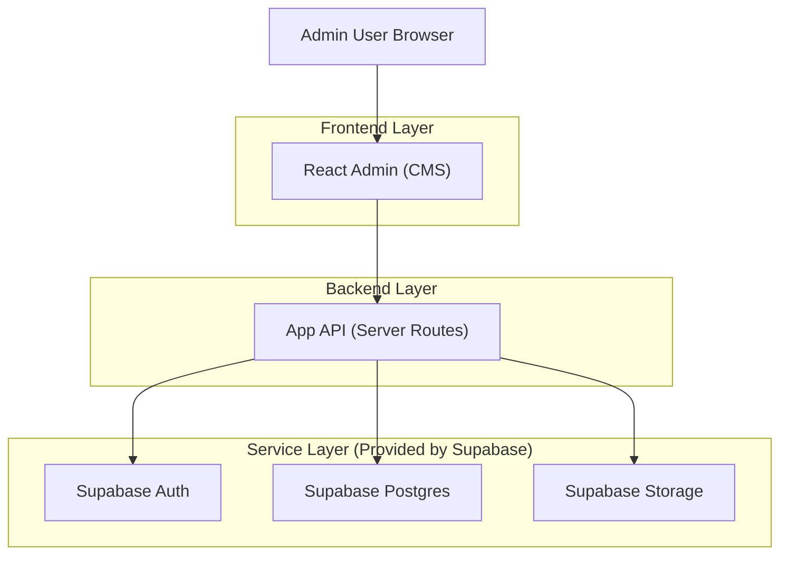
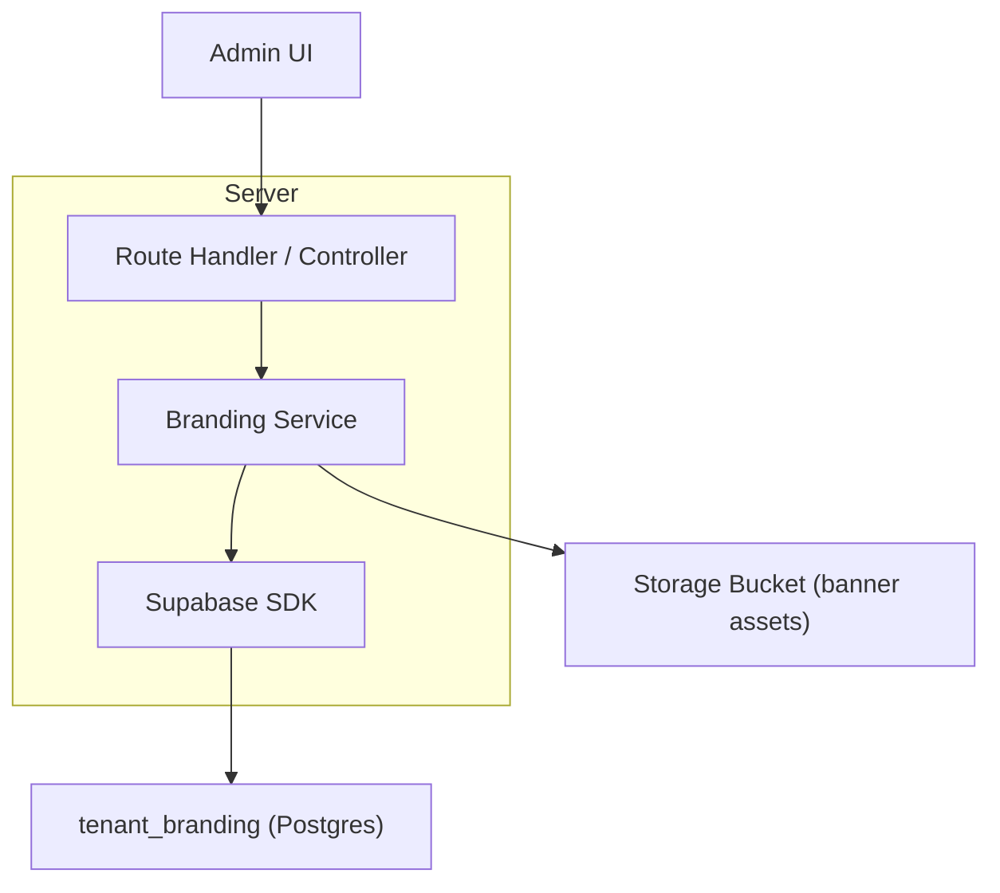
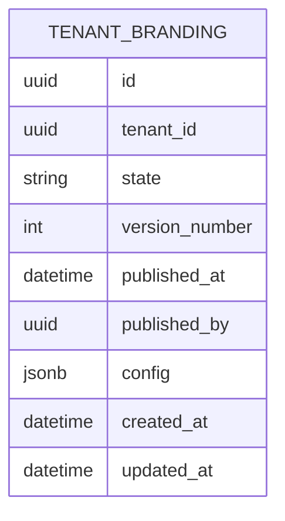

## 1.Architecture design



## 2.Technology Description

* Frontend: React\@18 (admin UI) + tailwindcss\@3

* Backend: App server routes (e.g., Next.js Route Handlers / equivalent)

* Database/Storage/Auth: Supabase (PostgreSQL + Storage + Auth)

## 3.Route definitions

| Route                           | Purpose                                                    |
| ------------------------------- | ---------------------------------------------------------- |
| /admin/cms/branding/main-banner | Main Banner editor with draft + preview + publish controls |

## 4.API definitions (If it includes backend services)

### 4.1 Core API

GET /api/admin/branding/main-banner

* Returns tenant-scoped draft + published summary (e.g., timestamps/version)

PUT /api/admin/branding/main-banner/draft

* Saves partial or full draft payload; validates ranges; normalizes values

POST /api/admin/branding/main-banner/publish

* Promotes current draft to published; records publisher + time; invalidates theme/banner cache if applicable

POST /api/admin/branding/assets/upload

* Accepts multipart upload (or signed-upload handshake); sanitizes SVG; stores to Supabase Storage; returns public URL

Shared types (TypeScript)

```ts
type Breakpoint = "mobile" | "tablet" | "desktop";

type BannerOverlay = {
  enabled: boolean;
  position?: "left" | "center" | "right";
  headline?: string;
  subheadline?: string;
  ctaLabel?: string;
  ctaUrl?: string;
  bgStyle?: "none" | "darkScrim" | "lightScrim" | "solid";
  bgOpacity?: number; // 0-100
  textColor?: string; // "#rrggbb"
};

type MainBannerDraft = {
  imageUrl: string;
  heights: Record<Breakpoint, number>; // 100-1200
  objectPosition: string; // e.g. "50% 30%" or "center"
  overlay: BannerOverlay;
};
```

## 5.Server architecture diagram (If it includes backend services)



## 6.Data model(if applicable)

### 6.1 Data model definition



### 6.2 Data Definition Language

Tenant Branding (tenant\_branding)

```
CREATE TABLE tenant_branding (
  id UUID PRIMARY KEY DEFAULT gen_random_uuid(),
  tenant_id UUID NOT NULL,
  state VARCHAR(16) NOT NULL CHECK (state IN ('draft','published','archived')),
  version_number INTEGER NOT NULL DEFAULT 1,
  published_at TIMESTAMPTZ,
  published_by UUID,
  config JSONB NOT NULL DEFAULT '{}'::jsonb,
  created_at TIMESTAMPTZ NOT NULL DEFAULT NOW(),
  updated_at TIMESTAMPTZ NOT NULL DEFAULT NOW()
);

-- Access (typical Supabase pattern)
GRANT SELECT ON tenant_branding TO anon;
GRANT ALL PRIVILEGES ON tenant_branding TO authenticated;
```

Config JSON path
