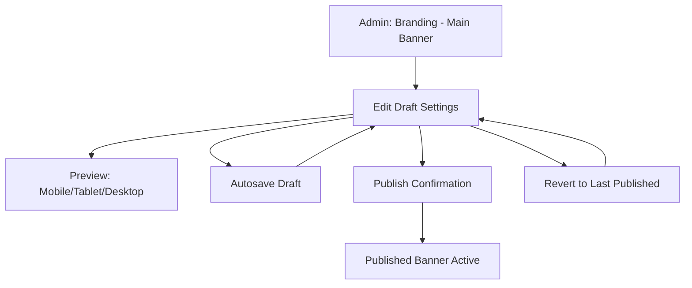

## 1. Product Overview
Admin → CMS → Branding lets you configure the storefront **Main (Hero) Banner** without code.
You can upload an image, tune responsive heights/focal point/overlay, preview at breakpoints, and publish.

## 2. Core Features

### 2.1 User Roles
| Role | Registration Method | Core Permissions |
|------|---------------------|------------------|
| Admin | Existing admin auth | View/edit draft, upload assets, publish, revert to last published |
| Operator | Existing admin auth | View/edit draft, upload assets; publish/revert only if permitted by org policy |

### 2.2 Feature Module
1. **Branding: Main Banner**: banner editor form, breakpoint preview, draft autosave, publish/revert.

### 2.3 Page Details
| Page Name | Module Name | Feature description |
|---|---|---|
| Branding: Main Banner | Tenant context | Resolve tenant server-side; load/save config scoped to tenant; never trust client-supplied tenant id. |
| Branding: Main Banner | Banner image | Upload JPG/PNG/WEBP/SVG (static), max 5MB; show thumbnail + detected dimensions; replace/remove image. |
| Branding: Main Banner | Responsive heights | Edit heights per breakpoint (mobile <768, tablet 768–1279, desktop ≥1280); validate integer 100–1200; apply width=100vw. |
| Branding: Main Banner | Focal point / object position | Set `object-position` via preset (Top/Center/Bottom/Left/Right) or custom (`"50% 30%"`); optional click-to-pick focal point stored as normalized object-position. |
| Branding: Main Banner | Overlay content (optional) | Toggle overlay; configure position (Left/Center/Right), headline (≤80), subheadline (≤160), CTA label (≤30) + CTA URL (required if label set), background style + opacity (0–100), text color. |
| Branding: Main Banner | Live preview | Render preview using **draft** state; breakpoint switcher (375/768/1280); update on change (debounced ~300ms) and on blur for text inputs; show “Unpublished changes” banner. |
| Branding: Main Banner | Draft/publish controls | Autosave draft; show dirty state; publish with confirmation + brief change summary; “Revert to last published” with confirmation. |
| Branding: Main Banner | Validation & safety | Validate file type/size client+server; sanitize SVG server-side; normalize colors to lowercase hex where used; block publish on invalid fields. |

## 3. Core Process
You open Admin → CMS → Branding → Main Banner, upload/replace an image, adjust responsive heights and focal point, optionally add overlay text/CTA, verify results by switching preview breakpoints, then publish to apply to the live storefront. If you make mistakes, you revert draft back to the last published state.

