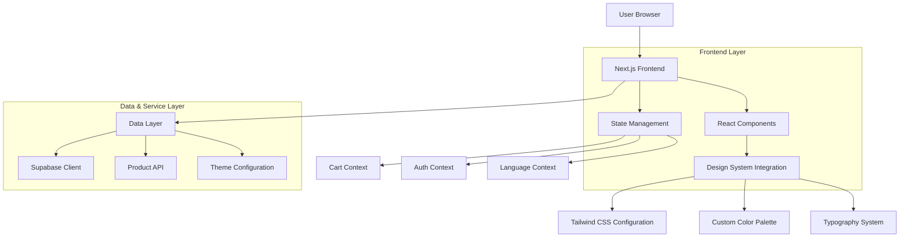

## 1. Architecture Design



## 2. Technology Description

**Frontend Stack:**
- Next.js 14 with App Router
- React 18 with TypeScript
- Tailwind CSS 3 with custom configuration
- Material Symbols for iconography
- Custom font integration (Manrope + Inter)

**State Management:**
- React Context for cart, auth, and language
- Custom hooks for data fetching and UI state

**Data Layer:**
- Supabase client SDK for database operations
- Existing product/service APIs
- Theme configuration system

**Key Dependencies:**
```json
{
  "next": "^14.0.0",
  "react": "^18.3.1",
  "typescript": "^5.0.0",
  "tailwindcss": "^3.4.17",
  "@supabase/supabase-js": "^2.38.0",
  "lucide-react": "^0.454.0"
}
```

## 3. Route Definitions

| Route | Purpose | Implementation Status |
|-------|---------|----------------------|
| `/` | Homepage with new premium design | Complete redesign needed |
| `/products` | Product catalog (existing) | Link integration |
| `/services/*` | Service pages (existing) | Navigation integration |
| `/ai-studio` | AI design tools (existing) | Navigation integration |
| `/auth/*` | Authentication (existing) | Style consistency |
| `/checkout` | Cart checkout (existing) | Navigation integration |

## 4. Component Architecture

### 4.1 Homepage Component Structure
```typescript
// app/page.tsx - Main homepage component
export default function HomePage() {
  return (
    <main className="min-h-screen">
      <PremiumNavigation />
      <EditorialHero />
      <InteractiveRoadmap />
      <ServicesShowcase />
      <FirstPurchaseGuide />
      <PremiumFooter />
    </main>
  )
}
```

### 4.2 New Components Required

**PremiumNavigation Component:**
```typescript
interface PremiumNavigationProps {
  className?: string;
  glassEffect?: boolean;
}

// Features: Glassmorphism, refined typography, icon integration
```

**EditorialHero Component:**
```typescript
interface EditorialHeroProps {
  title: string;
  subtitle: string;
  primaryCTA: HeroCTA;
  secondaryCTA?: HeroCTA;
  backgroundImage?: string;
}

interface HeroCTA {
  text: string;
  href: string;
  variant: 'primary' | 'secondary';
}
```

**InteractiveRoadmap Component:**
```typescript
interface ProcessStep {
  id: number;
  title: string;
  description: string;
  icon: string;
  color: 'primary' | 'secondary';
}

interface InteractiveRoadmapProps {
  steps: ProcessStep[];
  title: string;
}
```

**ServicesShowcase Component:**
```typescript
interface ServiceCard {
  id: string;
  title: string;
  description: string;
  image: string;
  icon: string;
  href: string;
}

interface ServicesShowcaseProps {
  services: ServiceCard[];
  title: string;
  viewAllHref: string;
}
```

### 4.3 Tailwind Configuration Updates

```javascript
// tailwind.config.js additions
module.exports = {
  theme: {
    extend: {
      colors: {
        // Premium color palette from design system
        'primary': '#af101a',
        'primary-container': '#d32f2f',
        'secondary': '#006c4b',
        'surface': '#f9f9fc',
        'surface-container-low': '#f3f3f6',
        'surface-container-lowest': '#ffffff',
        'on-surface': '#1a1c1e',
        'outline-variant': '#e4beba',
      },
      fontFamily: {
        'headline': ['Manrope', 'sans-serif'],
        'body': ['Inter', 'sans-serif'],
      },
      boxShadow: {
        'editorial': '0 20px 40px -20px rgba(26, 28, 30, 0.04)',
        'ambient': '0 40px 40px -20px rgba(26, 28, 30, 0.04)',
      },
      backdropBlur: {
        'glass': '24px',
      },
      opacity: {
        'glass': '0.8',
        'ghost-border': '0.2',
      }
    }
  }
}
```

## 5. Implementation Steps

### Phase 1: Foundation Setup
1. **Update Tailwind Configuration**
   - Add premium color palette
   - Configure font families (Manrope, Inter)
   - Set up custom shadows and opacity values

2. **Font Integration**
   - Add Google Fonts links to layout
   - Configure font loading optimization
   - Set up font fallbacks

3. **Icon System Setup**
   - Integrate Material Symbols
   - Configure icon variations
   - Set up icon sizing system

### Phase 2: Component Development
1. **PremiumNavigation Component**
   - Implement glassmorphism effects
   - Create responsive navigation structure
   - Integrate with existing auth/cart systems

2. **EditorialHero Component**
   - Build hero section with gradient overlays
   - Implement dramatic typography scaling
   - Create dual CTA button system

3. **InteractiveRoadmap Component**
   - Develop 4-step process visualization
   - Implement background number effects
   - Create responsive grid layout

4. **ServicesShowcase Component**
   - Build service card components
   - Implement hover animations
   - Create image-heavy card layouts

5. **FirstPurchaseGuide Component**
   - Develop step-by-step guide
   - Implement circular step indicators
   - Create compelling copy sections

6. **PremiumFooter Component**
   - Build clean footer structure
   - Integrate brand messaging
   - Add social/language options

### Phase 3: Integration & Testing
1. **Homepage Integration**
   - Replace existing homepage content
   - Maintain existing functionality
   - Ensure proper data flow

2. **Responsive Testing**
   - Test across all breakpoints
   - Optimize mobile interactions
   - Verify touch targets

3. **Performance Optimization**
   - Optimize image loading
   - Implement lazy loading
   - Minimize bundle size

4. **Accessibility Testing**
   - Ensure WCAG compliance
   - Test keyboard navigation
   - Verify screen reader support

### Phase 4: Content Integration
1. **Translation System**
   - Update language files
   - Add new content strings
   - Maintain i18n compatibility

2. **Dynamic Content**
   - Integrate with existing product APIs
   - Maintain cart functionality
   - Preserve user authentication

3. **Theme Consistency**
   - Ensure design system consistency
   - Update existing components
   - Maintain brand coherence

## 6. Data Models (Existing Integration)

The homepage integrates with existing data models:

**Products:** Existing product catalog with featured flag
**Services:** Service categories and descriptions
**User Profiles:** Authentication and personalization
**Cart Items:** Shopping cart state management

## 7. Performance Considerations

**Optimization Strategies:**
- Implement component-level code splitting
- Use Next.js Image optimization
- Configure proper caching headers
- Implement progressive enhancement

**Bundle Size Management:**
- Tree-shake unused design tokens
- Optimize font loading
- Lazy load heavy components
- Use efficient image formats

## 8. Testing Strategy

**Unit Tests:**
- Component rendering tests
- Interaction behavior tests
- Responsive breakpoint tests

**Integration Tests:**
- Navigation flow tests
- Cart functionality tests
- Authentication flow tests

**Visual Regression Tests:**
- Cross-browser compatibility
- Mobile device testing
- Accessibility compliance testing