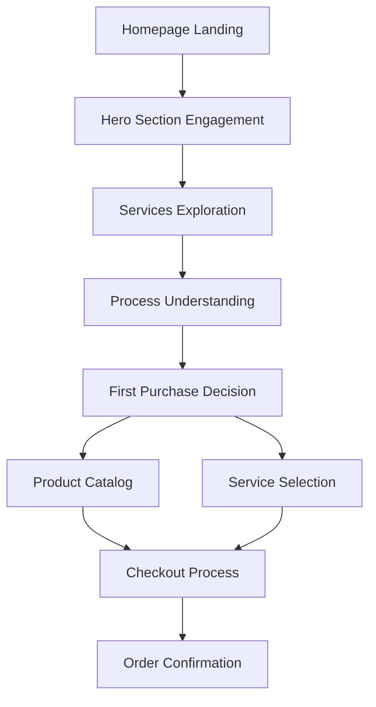

## 1. Product Overview
Transform the current DeliveryPrint homepage into a premium, editorial-grade digital experience following "The Digital Lithograph" design philosophy. The new homepage will elevate the brand from a standard utility service to a sophisticated print-on-demand platform with tactile luxury aesthetics.

The redesign focuses on creating a cleaner, more professional homepage that emphasizes quality, precision, and premium printing services while maintaining core functionality and user experience flow.

## 2. Core Features

### 2.1 User Roles
| Role | Registration Method | Core Permissions |
|------|---------------------|------------------|
| Visitor | Anonymous browsing | View homepage, browse products, view services |
| Customer | Email registration | Full access to products, cart, checkout, order management |
| Admin | Invitation/admin creation | Access to admin dashboard, user management, system settings |

### 2.2 Feature Module
The cleaner homepage consists of the following main sections:
1. **Premium Navigation**: Glassmorphism header with refined typography and iconography
2. **Editorial Hero Section**: High-impact hero with dramatic typography and premium imagery
3. **Interactive Process Roadmap**: 4-step visual journey through the printing process
4. **Services Showcase**: Curated service cards with hover effects and premium styling
5. **First Purchase Guide**: Step-by-step onboarding for new customers
6. **Premium Footer**: Clean, professional footer with brand messaging

### 2.3 Page Details
| Page Name | Module Name | Feature description |
|-----------|-------------|---------------------|
| Home Page | Premium Navigation | Implement glassmorphism header with 80% opacity backdrop blur, refined navigation links, and premium iconography |
| Home Page | Editorial Hero Section | Display full-width hero with gradient overlay, dramatic display typography (Manrope 3.5rem), and dual CTA buttons |
| Home Page | Interactive Process Roadmap | Show 4-step process with large background numbers, icon-based cards, and editorial shadow effects |
| Home Page | Services Showcase | Present 3 service categories (Gran Formato, Impresión Digital, Estudio de Diseño) with hover animations and premium card styling |
| Home Page | First Purchase Guide | Display 3-step onboarding process with circular step indicators and compelling copy |
| Home Page | Premium Footer | Clean footer with brand statement, navigation links, and social/language options |

## 3. Core Process
**Visitor Journey Flow:**
1. User lands on homepage → Views premium hero section with editorial messaging
2. Explores services through interactive cards → Clicks to learn more about specific services
3. Reviews the 4-step process roadmap → Understands the printing workflow
4. Views first purchase guide → Gets confidence to start ordering
5. Clicks primary CTA → Proceeds to product catalog or service pages

**Customer Journey Flow:**
1. Returning customer sees personalized navigation → Accesses dashboard and previous orders
2. Uses cart functionality with premium styling → Completes checkout process
3. Accesses AI Studio for custom designs → Creates personalized products

## 4. User Interface Design

### 4.1 Design Style
**Color Palette:**
- Primary: #af101a (Heritage Red) to #d32f2f gradient
- Secondary: #006c4b (Forest Green) for trust indicators
- Surface: #f9f9fc (Base canvas) with layered container hierarchy
- Text: #1a1c1e (On-surface) for editorial tone

**Typography:**
- Headlines: Manrope (Display-lg 3.5rem, Headline-lg 2rem)
- Body: Inter (Body-lg 1rem with 1.6 line-height)
- Labels: Inter uppercase with +0.05em letter spacing

**Component Styling:**
- Buttons: Gradient-fill primary, ghost-border secondary, md (0.375rem) radius
- Cards: Surface-container-lowest (#ffffff) with editorial-shadow
- Borders: No 1px solid dividers - use surface color shifts only
- Spacing: spacing-24 (6rem) for section padding to indicate luxury

**Layout Principles:**
- Intentional asymmetry with overlapping elements
- Editorial scaling with dramatic typography
- Tonal depth through surface layering
- Glassmorphism for floating elements

### 4.2 Page Design Overview
| Page Name | Module Name | UI Elements |
|-----------|-------------|-------------|
| Home Page | Premium Navigation | Glass background (80% opacity, 24px blur), Manrope logo typography, refined navigation links with hover states |
| Home Page | Editorial Hero | Full-width section (870px height), gradient overlay (surface via surface/60 to transparent), 7xl headline font, dual CTA buttons |
| Home Page | Process Roadmap | 4-column grid with background numbers (9xl, 3% opacity), icon-based cards with editorial shadows, primary/secondary color accents |
| Home Page | Services Grid | 3-column responsive grid, image-heavy cards (60% height), hover lift effects with transition transforms |
| Home Page | Purchase Guide | 2-column layout (LG), circular step indicators, compelling copy with secondary color accents |

### 4.3 Responsiveness
- **Desktop-first approach** with mobile adaptation
- **Breakpoint strategy**: Full experience at 1024px+, optimized mobile at 768px-
- **Touch optimization** for mobile interactions with larger tap targets
- **Responsive typography** scaling down appropriately on smaller screens

### 4.4 Premium Design Guidelines
**The "No-Line" Rule:**
- Prohibit 1px solid borders for section separation
- Use background color shifts (surface-container hierarchy) for boundaries
- Implement "Ghost Borders" at 20% opacity only when necessary

**Surface Layering:**
- Level 0: #f9f9fc (main canvas)
- Level 1: #f3f3f6 (secondary content areas)
- Level 2: #ffffff (primary cards and interactions)
- Glass effect: 80% opacity with backdrop blur for navigation

**Interaction States:**
- Hover: 2px vertical translation with ambient shadow (40px blur, 4% opacity)
- Focus: Primary color transitions with 2px thickness
- Active: Scale effects (95% to 90%) for tactile feedback